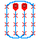
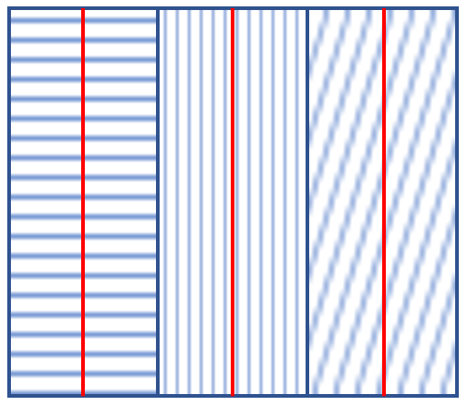
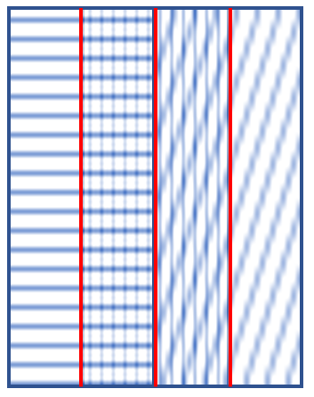

# User-manual

The ScienceFlightPlanner Plugin helps in improving your workflow when planning scientific flight surveys.

In addition to this help manual, you can find tutorial videos for using our plugin on our YouTube channel [ScienceFlightPlanner](https://www.youtube.com/channel/UCkSBaCW_Sohcqlh8Pu6tufg).

## Feature Overview

Feature name | Access via | Short Description | Applicable to layer geometry
------------|------------|-------------------|----------------------
Display Flight Distance |  | Shows the length (km) of the current flight plan. | Line
Display Flight Duration |  | Shows the expected flight duration (h) of the current flight plan. | Line
Generate Waypoints for Flight Plan |  | Generates a new shp-file which contains all waypoints (numbered from 1 to n) of the current flight plan. | Line
Combine Flightplans |  | Combines 2 flight plans based on the selected way point in each flight plan. | Points
Export in Garmin GTN750Xi Format |  | Generates a wpt- and a gfp-file for the Garmin GTN™ 750Xi based on the current flight plan. | Points
Add Tag to Selected Waypoints |  | Adds a tag to the selected waypoints of the current flight plan. | Points
Mark Selected Waypoints as Significant |  | Marks the selected waypoints of the current flight plan as significant. | Points
Generate Reduced Flight Plan from Significant Waypoints |  | Extracts waypoints of currently selected waypoints that were previously marked as significant to a new shapefile. | Points
Reverse Waypoints |  | Reverses the order of current waypoints or flight plan. | Line, Points
Show Coverage | Sensor selection box in toolbar | When a specific sensor is chosen, the current flight plan's coverage for this specific sensor and flight altitude is computed and saved to a new shp-file. | Line
Compute Optimal Coverage Lines |  | Given a sensor and an area of interest are selected, optimal flight lines are computed which coverage covers the selected area. | Polygon
Cut Flowline |  | Given flowline a new flowline will be cut off at the selected waypoints and saved in a new layer. | Points
Create Racetrack Pattern for Polygon |  | Given a polygon, flight altitude, and max turning distance, calculates optimal waypoints for a plane based on the selected algorithm. | Polygon
Create Topography Profile |  | Given a wpt layer, a digital elevation model (.tif), and a maximum climb rate of a plane, it generates a topography profile that highlights zones where the required climb rate exceeds the aircraft's performance. | Points

## Detailed Feature Description

### Display Flight Distance

When the above button is pressed and a line layer is selected [(FAQ)](#faq), then the length (km) of the flight plan in this layer is shown. While activated, the display of the flight distance updates in accordance to changes in the layer/feature selection [(FAQ)](#faq). If the button is pressed again, the display of the length is toggled. Whether the tool is activated, is indicated by toggling the button.

### Display Expected Flight Duration

When the above button is pressed and a line layer is selected [(FAQ)](#faq), the expected duration (h) for flying along the flight plan in this layer is shown. While activated, the display of the flight duration updates in accordance to changes in the layer/feature selection [(FAQ)](#faq). If the button is pressed again, the display of the duration is toggled. Whether the tool is activated, is indicated by toggling the button.

The used flight speed can be set in the plugin settings [(FAQ)](#faq) with a default speed set to 200km/h.

### Generate Waypoints for Flight Plan

When the above button is pressed and a line layer is selected [(FAQ)](#faq), all waypoints of this layer's flight plan are extracted. A waypoint is defined as each point in the flight path where the flight changes direction.

A window will pop up in which you can set the name and location of the shp-file in which the extracted waypoints will be stored as points.

### Combine Flightplans

This feature allows you to combine two separate flight plans into one continuous flight plan.
To use this feature:

1. Select exactly two coordinate points from two different point layers
2. Press the Combine Flightplans button
3. Choose which flight plan should be the starting point (waypoint 1)
4. A new layer will be created containing the combined flightplan

**Important Requirements:**

- Both layers must have the same Coordinate Reference System (CRS)
- Both layers must be point geometry layers
- Both layers must have an "id" field with all features having a unique ID value
- You must select exactly one point from each layer to serve as the connection points

The resulting combined flight plan preserves all waypoints from both original plans, with sequential IDs starting from the selected point in the first flight plan, continuing through the second flight plan, and then returning to complete any remaining points in the first flight plan.

Any tags associated with the original waypoints will be preserved in the combined flight plan.

### Export in Garmin GTN750Xi Format

When the above button is pressed, the selected flight plan file will be transformed into flight plans files compatible with the Garmin GTN750Xi.

After pressing the button, the selected .wpt file will be transformed into two files of following format:
- example_user.wpt (MUST be named _user.wpt for import)
- example_gfp.gfp

Hint: To avoid the GTN750 system assigning a generic ID to the waypoint coordinates, import the user.wpt file first and then import the .gfp file.

### Add Tag to Selected Waypoints

After selecting a waypoint or multiple waypoints [(FAQ)](#faq) and pressing this button, a label is added to the point.

You can choose from the following predefined tags:
- FLYOVER
- FLYBY
- RH180 – Right Hand 180°
- RH270 – Right Hand 270°
- LH180 – Left Hand 180°
- LH270 – Left Hand 270°

Additionally, you can create a custom tag. Note that custom tags must not exceed **10 characters** in length.

Viewing Tags:

After adding a tag, select the corresponding waypoint to see the tag displayed in the **status bar** at the bottom of the screen.

To view all waypoints and their associated tags:
1. Select the **waypoint layer**.
2. Open the **Attribute Table** (right-click → "Open Attribute Table").

### Mark Selected Waypoints as Significant

When the above button is pressed and some waypoints are selected [(FAQ)](#faq) they are marked as significant. This means a field "sig" is added to the attribute table of the points which you have to confirm.

Afterwards each significant point is marked with a little star.

### Generate Reduced Flight Plan from Significant Waypoints

When the above button is pressed and waypoints in the current layer were previously marked as significant, i.e. the flight plan layer has the field "sig", as generated by ["Mark Selected Waypoints as Significant"](#mark-selected-waypoints-as-significant), the waypoints chosen to be significant will be saved in a new shp-file. The points in the new shp-file have ids according to their position in the original flight plan.

In the following pop-up you can then select location and name of the new file.

### Reverse Waypoints

When the above button is pressed and a line layer or a layer containing waypoints is selected [(FAQ)](#faq) and the features have the field id, the order of the waypoints or the layer's flight plan is reversed.

**Example:** If the starting point had number 1 and the end point number 30 and the waypoints are reversed, the original starting point will then be number 30 and the original end point number 1.

### Show Coverage

When a line layer is selected [(FAQ)](#faq) and a sensor in the sensor selection box of the plugin toolbar is selected, a new shp-file will be created containing the area which is covered by the flight plan in the layer for a specific flight altitude and the selected sensor.

Given a coverage shp-file has been created for the current flight plan and sensor, changing the flight altitude or the sensor settings results in an update of the corresponding coverage shp-file. The flight altitude can be changed in the flight altitude SpinBox in the plugin's toolbar. Sensors can be added, deleted or changed in the plugin settings [(FAQ)](#faq).

Before this feature can be used, it is necessary to set the CRS used for coverage computations in the plugin settings. The CRS should be compatible with the region of the QGIS project.

### Compute Optimal Coverage Lines

When the above button is pressed, optimal flight lines are computed given a sensor and a polygon, representing an area of interest, are selected. These lines can be used as a template for a flight plan over the area of interest which for the selected sensor has some amount of overlap with as few turns as possible.

The flight altitude can be changed in the flight altitude SpinBox in the toolbar and sensors can be added, deleted or changed in the plugin settings [(FAQ)](#faq).

The amount of overlap which is considered when creating the optimal flight lines can also be changed in the plugin settings. Overlap means how much adjacent coverage segments overlap each other (see example below).

**0% overlap**

**50% overlap**

Additionally, it is possible to use two different settings for the line computations. The default setting, which we strongly suggest to use, is called "optimal". In this case the lines are optimal w.r.t. the criteria described above. Choosing "90° rotated" means that the lines are 90° rotated from the optimal orientation. Therefore, they are no longer optimal but depending on the flight plan and use case this might still be useful.

In order to use this feature for the first time it is necessary to set the CRS used for coverage computations in the plugin settings. The CRS should be compatible with the region of the QGIS project.

### Cut Flowline

To use this feature:

1. **Select Points on the Flowline:** Use the selection tool to mark two points along the flowline where the cut should occur.
2. **Execute the Cut:** Click the cut button to create a new line from the existing flowline.
3. **View the Output:** A new layer is automatically created containing the resulting cut segment of the flowline.

### Create Racetrack Pattern for Polygon

The Racetrack feature calculates optimal waypoints for a plane when the designated button is pressed. These waypoints are determined based on the selected sensor, polygon-layer representing the area of interest, and flight altitude. Note that the selected polygon layer must contain only one feature.

#### Key Features of Waypoints

**Fly-over Tag:** Each waypoint is assigned a fly-over tag by default.  
**Unique IDs:** Waypoints are assigned unique IDs based on the selected algorithm, indicating the order in which they need to be flown over.

The algorithms are designed to optimize the flight path when flying over a grid. You can choose between two algorithms:

**Please note:**
- The selected polygon layer **must** contain only one feature!
- The polygon's projection **must** match the map's projection exactly!

#### - Meander Algorithm

The plane flies over `k` waypoints repeatedly until it reaches the end of the grid.  
It then moves back by 1 waypoint.  
The plane continues flying `k` waypoints in the opposite direction, repeating the process until the grid is fully covered.

#### - Racetrack Algorithm

The plane flies over the first `k` waypoints (determined by the maximum turning distance).  
It then flies back over `k-1` waypoints, reversing direction.  
This process repeats until the entire area is covered.

If you prefer not to use any of the algorithms, simply set a very small max-turn-distance. The generated waypoints will then traverse the entire polygon in sequential order.

#### Suggested Naming for Output Files

The generated output files include the maximum turning distance in their filenames to make them easily identifiable.

### Create Topography Profile

This feature allows to generate a detailed elevation profile along a flight path by overlaying waypoint data onto a digital elevation model (DEM).

**Graph Generation**  
When a waypoint layer is selected and the topography button is pressed, select a DEM file. The feature will then generate a graph in a dock window. The top of this window shows the waypoint numbers, which correspond directly to the points on the selected flight path.

**Graph Interaction and Navigation**  
The dock window includes zoom controls - you can zoom in and out for better visibility. There is also a full zoom out button in the bottom left corner for a full view of the topography. The dock window also supports dragging the graph with a cursor.

**Critical Zones Indicator**  
The profile graph visually highlights critical zones in red - areas where the climb rate needed to maintain the current altitude above the terrain exceeds the aircraft's available climb rate. The critical zones can be seen ob both the graph and the layer. An aircraft's **climb rate** can be entered in the 'Maximum climb rate in feet/min' field in the toolbar.

## FAQ

#### What does it mean that some feature has to be selected?

This means, that either the feature is the only feature in the current layer or the feature is selected with the QGIS selection tool which can be found in the standard toolbar ("Selection Toolbar") or via "Edit ▶ Select".

#### How can I select multiple features?

Especially when you want to mark multiple points as significant it is useful to select multiple points. To select multiple points, press and hold the "CRTL" key (on Mac: "Command" key) and click on the features you want to select.

#### Where can the plugin settings be found?

The plugin setting can be found under: "Settings ▶ Options... ▶ ScienceFlightPlanner". There it is possible to change the flight speed, the CRS used for computing sensor coverage, the setting used for computing overlap and to add, delete or change sensors.

#### I've activated the flight duration/distance display, how is it updated?

When the flight duration/distance display is activated (indicated by a toggled button of the corresponding feature) the distance/duration is updated in accordance to the current layer/feature selection. This means that when for example changing the layer to a different line layer, the distance/duration is updated to match the new layer. If the layer contains multiple features, it is required to explicitly select one feature for which the distance/duration is to be shown. Similarly, as for a new layer selection, a new feature selection within the current layer results in an update of the distance/duration. When a layer of a geometry other than line is selected, the display is toggled until a layer of type line is selected again.

#### I've created a racetrack for a polygon, but I don't see the way points

If the selected polygon uses a different projection to the map, the generated waypoints will not be visible. Make sure the projection is the same and generate a racetrack again.

## Acknowledgments

This plugin makes use of [**garmin_fpl**](https://github.com/awi-response/garmin_fpl):

Rettelbach, T., Döpper, V., & Nitze, I. (2024). garmin_fpl: Creation and conversion scripts for Garmin flightplans for scientific flight campaigns [Computer software]
