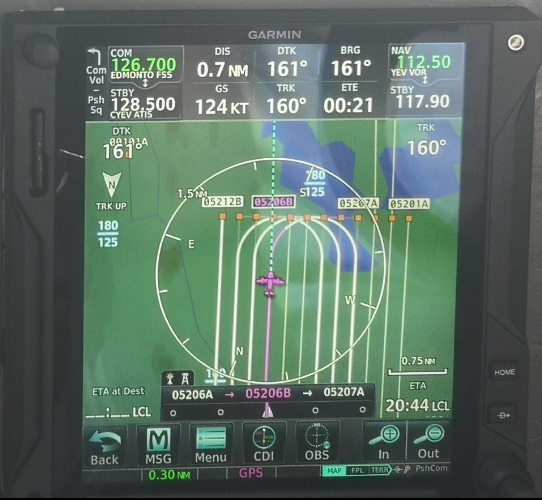
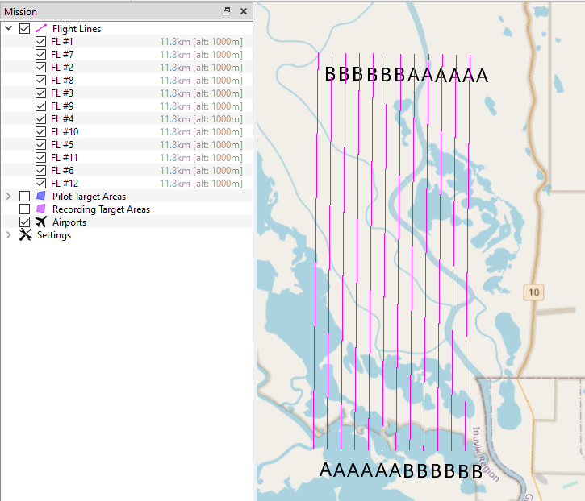

# General info
This repo provides scripts that facilitate the creation of flightplans compatible with the Garmin GTN750.
The scripts have originally been created for the Perma-X Canada 2023 airborne campaign. As the focus of this campaign lay on aerial imaging, most targets were flown as grids (for later photogrammetric processing). Thus, some naming conventions and specificties within the scripts are in some ways optimized towards this kind of grid-pattern flying. Nevertheless, they are also compatible with line-survey flights (transects).

Within the GTN750, (grid) flightplans usually look something like this (this is what the pilots see in the cockpit):

This target was called *052_DeltaNorthHF_01_1000m*

In order to import this flightplan into the GTN750, two files are necessary:
- [`052_DeltaNorthHF_01_1000m_user_renamed.wpt`](https://github.com/awi-response/garmin_fpl/blob/GTN750_flightplanning/example_project/052_DeltaNorthHF_01_1000m_user_renamed.wpt) (however, must be named `user.wpt` for import. Details see below)
- [`052_DeltaNorthHF_01_1000m_fpl.gfp`](https://github.com/awi-response/garmin_fpl/blob/GTN750_flightplanning/example_project/052_DeltaNorthHF_01_1000m_fpl.gfp))

The following gives some more info on characteristics and requirements for these two file types.

## User waypoints

To import user waypoints into the GTN750, they must be all stored in one file that fulfills the following requirements:

- name: 'user.wpt'
- each waypoint in this file has its own line
- The GTN750 can store xxx waypoints
- waypoints are defined with four columns, separated by a ','.
The columns are:
   - **Waypoint ID**: max. 6 alphanumeric characters (all UPPERCASE). Names can probably be used multiple times, but this is not recommended. This ID is the one that pilot will see in their maps during flight (e.g., `05206B` in the figure above).
   - **Waypoint comment**: max. 25 alphanumeric characters (all UPPERCASE). The comment can only be seen by the pilots when looking at the list of user waypoints. Not that easy to access when actually following a flightplan. The comments do not need to be unique either.
   - **Latitude** in decimal degrees. e.g., '67.503777168'. Number of decimal places is (probably) not limited.
   - **Longitude** in decimal degrees. e.g., '-133.7815498'. Number of decimal places is (probably) not limited.
- Waypoints cannot be closer than 0.001° to each other (111m). If this happens, the GTN750 will only import the first waypoint with 'this' coordinate; the second one that is in the 111m-vicinity will be ignored!
This is especially relevant to consider when flying survey grids --> lines need to be far enough apart._ Reason: The user waypoints (as defined in the `user.wpt` are only single points with a name (the ID from the first columm).
A flightplan instead puts different coordinates into an order, but with NO name. The name of these ordered coordinates will be assigned by the closesst user waypiont which was imported from the `user.wpt` to that coordinate.
Now here comes the problem: The FLP coordinate is in DMM format with only one decimal accuracy. Hence the name of this coordinate will be defined by the closest user waypoint in the 0.001°-radius. Closer lines can really mess up the naming of the points._
- User waypoints that were stored in the GTN750 stay in there until they are manually deleted. So creating and importing waypoints (via a new `user.wpt`) at a later point in time, might also generate this issue. Those that are already in the GTN750 will not be overwritten!
NOTE: The distance value of 0.001°/111 m was taken from the GTN750 manual. However, we already faced some issues with points that were 160 m apart. So be careful.
Some practical implications of this issue:
   - It is not possible to upload flightplans of an identical area with different flight altitude settings to e.g., spontaneously account for higher/lower cloud ceiling, footprint size...
   - It is not possible to upload overlapping flightplans if the final linespacing is lower than 0.001°
   - If you need to implement one of the above options: remove all existing user waypoints and flightplans and reimport a new `user.wpt` and new flightplans that only contain the 'new' altitude, ...
   - General recommendation: remove all existing user waypoints after each flight day to avoid issues with identical name / too close waypoints.
- the order of the waypoints in the `user.wpt` is not important

## Flightplans

For the GTN750 to be able to read prepared flightplans, they must fulfil certain (format) requirements:
- stored as .gfp (Garmin flightplan)
- coordinates must be in DDM format
- Syntax is the following:
  FPN/RI:F:N67302W133469:F:N67261W133470:F:N67260W133449:F:N67302W133448
  - always start with 'FPN/RI'
  - each coordinate is prefaced with ':F:'
  - coordinates are in Lat/Lon order
     - Lat prefaced with N or S; followed by exactly five digits in DMM: 67° 30.2' N becomes N67302
     - Lon prefaced with E or W; followed by exactly six digits in DMM: 133° 46.9' W becomes W133469
- .gfp-file is allowed to have only one line! The entire flightplan needs to be in this long line. Make sure, there is no empty new line.
- NOTE: For us, the import of a .gfp-file created on a unix operating system failed, only Windows worked. (Line ending problem?)
- You can have multiple .gfp-files (each corresponding to a different flightplan), or you can combine all your waypoints into one large flightplan. (For grid-survey flights, we had a flightplan per target of interest.)
- all .gfp-files need to be collected in one folder named 'FPL'
- The GTN750 can store up to 100 flightplans (?) --> this needs to be verified.
- there are possibilities to add more complex information to the flightplan (e.g., airports, runways, landing approaches, etc... --> see manual), but this is generally not necessary. (the simpler, the better ;) )

**As mentioned above: The coordinates of a .gfp-file do not have names/IDs. If you import a .gfp-file to the GTN750 without previously importing the `user.wpt` with waypoints of the corresponding coordinates  first, the system will give these coordinates a generic ID along the lines of USR001, USR002, etc... Hint: Some pilots do not like this, as all their waypoints in the GTN750 will have the same names).
If you want to avoid this, make sure that the user waypoints are imported before the flightplans are (the .gfp-files).**

# How to create flightplans for the GTN750
The main goal of the code presented here is the automated creation of said .gfp-files from the `user.wpt`.

If you are using the MACS-Missionplanner to prepare your flightplans, you should follow these steps:
1. create/open your flightplan in the [MACS-Missionplanner Software by DLR](https://macs.dlr.de/box)

2. File > Export > Garmin GTN Waypoint > Save as ["052_DeltaNorthHF_01_1000m_user.wpt"](https://github.com/awi-response/garmin_fpl/blob/GTN750_flightplanning/example_project/052_DeltaNorthHF_01_1000m_user.wpt)
   - As a requirement for our scripts, please follow these naming requirements:
     
     **iii_sitename_rr_aaaam_user.wpt**: with iii being a 3-digit-ID, rr being the repetion counter of the site, aaaam being the altitude above ground in m

     example: 052_DeltaNorthHF_01_1000m_user.wpt

If you are preparing a user.wpt file by yourself feel free to have a look at the files in the example_folder. In order to run the scripts, Be sure follow the naming conventions of waypoints and the user.wpt file:

**iii_sitename_rr_aaaam_user.wpt**: with iii being a 3-digit-ID, rr being the repetion counter of the site, aaaam being the altitude above ground in m

example: 052_DeltaNorthHF_01_1000m_user.wpt

FLll_A/FLll_B for grid flight patterns: ll being line number, A-B indicate the start/end of the line

iii## for transect flight patterns: iii being the 3-digit-ID, ## being the waypoint number

examples: FL01_A/FL01_B; 05201 

     

# The Scripts

## 01_create_gfp_from_userwpt.py
reads all `*_user.wpt`-files in a directory and creates a flightplan for each of them. The new name is then `*_fpl.gfp`.

it is based on these steps:

**1. 20230704_WPnameChanger.py:**

Background: Originally, when exported from MACS-MissionPlanner (vXX.XX), the waypoint-IDs are named FLll_A/FLll_B (ll being linenumber) e.g., 'FL02_A' or FL05_B', numbered consecutively in the order they were in the MACS-MissionPlanner .xml-file. The comments are based on the names visible in this upper left panel. Careful, this comments do not change the order of the flightlines. The waypoint name (FLll_A/FLll_B) is automatically derived by the **display** order of the flightlines.  HENCE: when exporting the mission, the IDs will start at FL01_A, independent on changed or adapted names. Make sure to order the lines correspondingly in the MACS mission planner so the displayed order matches the order of flightlines. When importing many different targets into the GTN, the identical naming of lightlines will become very confusing. It complicates the communication with the pilots. We therefore recommend renaming the waypoints and creating unique IDs and comments.

This script does that job for you: It creates an intermediate file ('* _user_renamed.wpt') for each mission, where the ID and comment are updated based on the NAME of the original '*_user.wpt' file. We therefore require the following file naming conventions for missions:

**iii_sitename_rr_aaaam_user.wpt** --> iii being an internally discussed 3 digit ID of the target area, rr the repetition of the area (01,02), aaaa the above ground altitude in m (e.g. 0750m).

In case you are working with the MACS Mission Planner, the following files should then ideally be named like this with and exemplary ID 004:

- MACS-MissionPlanner file: 004_sitename_01_1000m.xml
- user waypoint file: 004_sitename_01_1000m_user.wpt (export via MACS-MissionPlanner)
- geojson (if desired): 004_sitename_01_1000m.geojson (export via MACS-MissionPlanner)

The WPNameChanger also detects transect or grid as route Types depending in the waypoint name.
Please stick to the following waypoint naming conventions when not working with the MACS Mission planner:

- 'grid' for gridded flightmission, waypoint name requirement: FLll_A or FLll_B (ll stands for line number 01,02 etc, eg. FL01_A)
- 'transect' for a routing flightmission, waypoint name requirement: iii## (iii for ID code, ## for wapoint number, e.g 00101,00102,00103)
            
The waypoint comments will changed to: 

**iiiSITENAMEO** iii being the 3 digit ID, SITENAME an uppercase letter of the targetname, O the order (A/B) in case of a grid type. The script makes sure that the comment is not longer that 25 digits. In case the combination results in more than 25 digits, only the fist 8 and last 7 letters of the sitename will be used.

      - input: path to folder of iii_sitename_user.wpt files
      
      - output: iii_sitename_rr_aaaam_user_renamed.wpt

**2. 20230704_DEC2DMM.py**: 

Converts Decimal degree coordinates to Degree Decimal Minutes coordinates

    - input: the output file of 20230704_WPnameChange.py:  iii_sitename_rr_aaaam_user_renamed.wpt
    
    - output: iii_sitename_rr_aaaam_user_renamed_DMM.wpt: coordinates are changed to DDM format

**3. 20230704_wpt_to_gfp.py** 

Converts the information to a flightplan which is readable by Garmin

    - input: iii_sitename_rr_aaaam_user_renamed_DMM.wpt
    
    - output: returns a iii_sitename_rr_aaaam_flp.gfp file which can be imported to the Garmin
      
**Summary:**

      -input: path to folder of iii_sitename_user.wpt files
      
      -output:
         - iii_sitename_rr_aaaam_user_renamed.wpt
         - iii_sitename_rr_aaaam_user_renamed_DMM.wpt
         - iii_sitename_rr_aaaam_fpl.gfp

examples:
- [`052_DeltaNorthHF_01_1000m_user_renamed.wpt`](https://github.com/awi-response/garmin_fpl/blob/GTN750_flightplanning/example_project/052_DeltaNorthHF_01_1000m_user_renamed.wpt)
- [`052_DeltaNorthHF_01_1000m_user_renamed_DMM.wpt`](https://github.com/awi-response/garmin_fpl/blob/GTN750_flightplanning/example_project/052_DeltaNorthHF_01_1000m_user_renamed_DMM.wpt)
- [`052_DeltaNorthHF_01_1000m_fpl.gfp`](https://github.com/awi-response/garmin_fpl/blob/GTN750_flightplanning/example_project/052_DeltaNorthHF_01_1000m_fpl.gfp)

## 02_CombineWPT.py

Combines all iii_sitename_user_renamed.wpt files within a directory to one final user.wpt.
This user.wpt file is the import file for the Garmin user wpt import. This information containes the names for specific coordinates (here in decimal degree format). The iii_sitename_fpl.gfp file only containes the sequence of the different coordinates and extracts their names from this user.wpt file.
The user.wpt file will be stored in the same folder as all iii_sitename_user.wpt

**Summary:**

      - input: path to directory of all relevant iii_sitename_rr_aaaam_user_renamed.wpt of the day (when not changed: path of the folder containing all *_user.wpt of the day)
      
      - output: user.wpt

## 03_BBox_creator.py - optional

Script adds a bounding box with ~2 miles around target area. This information can be useful for the pilot for flight planning

**Summary:**

      - input: path to directory of all relevant iii_sitename_rr_aaaam_user_renamed.wpt of the day (when not changed: path of the folder containing all *_user.wpt of the day)
      
      - output: iii_sitename_rr_aaaam_user_renamed_BBox.wpt

example:
- [`052_DeltaNorthHF_01_1000m_user_renamed_BBox.wpt`](https://github.com/awi-response/garmin_fpl/blob/GTN750_flightplanning/example_project/052_DeltaNorthHF_01_1000m_user_renamed_BBox.wpt)

## 04_track_from_userwpt.py - optional

based on the final user.wpt this script creates a Track.txt file in the format needed for aircraft data acquisition.

**Summary:**
   
      - input: path to directory where user.wpt is stored (when not changed: path of the folder containing all *_user.wpt of the day)
      
      - output: Track.txt

**Example to run the code**:

      - cd C:\Users\path-to-flightplanning-tool\garmin_fpl-GTN750_flightplanning\
      - python 01_create_gfp_from_userwpt.pyf C:\Users\path-to-folder-of-user.wpts-of-the-day\example_project
      - python 02_CombineWPT.py C:\Users\path-to-folder-of-user.wpts-of-the-day\example_project
      - python 03_BBox_creator.py C:\Users\path-to-folder-of-user.wpts-of-the-day\example_project
      - python 04_track_from_userwpt.py C:\Users\path-to-folder-of-user.wpts-of-the-day\example_project
      

